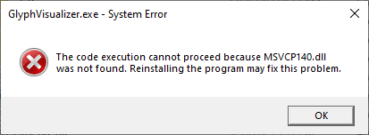

<div align="center">
  <p>
    <h1>GlyphVisualizer</h1>
    <h6>A Glyph composition player written with the Qt6 framework in C++ that plays Glyph compositions from Nothing Phones.</h6>
    <a href="https://github.com/SebiAi/GlyphVisualizer/releases/latest">
      
    </a>
    <a href="https://github.com/SebiAi/GlyphVisualizer/blob/main/LICENSE">
      
    </a>
    <p>
      <a href="https://ko-fi.com/Z8Z7CAN8M">
        
      </a>
    </p>
    <br><br>
    <video src="https://github.com/SebiAi/GlyphVisualizer/assets/41116921/c86e6f7a-e418-418c-8670-897158e792b1" controls></video>
    <h6>
      Credit: First composition by
      <a href="https://x.com/MrSteel_X/status/1701143539806019611" target="_blank" rel="noopener noreferrer">Mr Steel</a>, Second composition by
      <a href="https://www.reddit.com/r/NothingTech/comments/165nu0w/glyph_synchronized_ringtone_showcase/" target="_blank" rel="noopener noreferrer">ImSteazyy</a>
    </h6>
  </p>
</div>

***

# :writing_hand: Table of contents

<!-- TOC Generator settings -->
<!-- Preset: GitHub -->
<!-- indent characters: '-*+' -->
<!-- generate anchors: True -->
<!-- anchors prefix: 'heading-' -->
<!-- concat spaces: True -->
<!-- comment style: HTML -->
<!-- indent spaces: 3 -->
<!-- algorithm used to generate anchors: DEFAULT -->
<!-- Max indent level: 3 -->
<!-- trim toc indent: True -->
<!-- oneshot: False -->
<!-- TOC start (generated with https://github.com/derlin/bitdowntoc) -->

- [:grey_question: What is this? Why would I need that?](#heading-grey_question-what-is-this-why-would-i-need-that)
- [:pushpin: Disclaimer](#heading-pushpin-disclaimer)
- [:rocket: How to use](#heading-rocket-how-to-use)
- [:inbox_tray: Installation](#heading-inbox_tray-installation)
   * [ Windows portable](#heading-windows-portable)
   * [:penguin: Linux](#heading-penguin-linux)
      + [ Ubuntu and derivatives](#heading-ubuntu-and-derivatives)
   * [ MacOS](#heading-macos)
- [:safety_vest: Need help?](#heading-safety_vest-need-help)
- [:page_with_curl: Roadmap](#heading-page_with_curl-roadmap)
- [:construction: Compilation](#heading-construction-compilation)
   * [:nut_and_bolt: Build Dependencies](#heading-nut_and_bolt-build-dependencies)
   * [:hammer_and_pick: Build](#heading-hammer_and_pick-build)
      + [ Windows portable](#heading-windows-portable-1)
      + [ Ubuntu and derivatives](#heading-ubuntu-and-derivatives-1)
      + [ MacOS](#heading-macos-1)
- [:interrobang: Troubleshooting](#heading-interrobang-troubleshooting)
   * [ Windows portable](#heading-windows-portable-2)
      + [Missing dlls](#heading-missing-dlls)

<!-- TOC end -->

***

<!-- TOC --><a name="heading-grey_question-what-is-this-why-would-i-need-that"></a>
# :grey_question: What is this? Why would I need that?
This is a tool that is meant to be used in combination with my [custom-nothing-glyph-tools](https://github.com/SebiAi/custom-nothing-glyph-tools/) scripts (*GlyphTranslator*, *GlyphModder*). When you create a custom ringtone or notification tone with these scripts, you want to test them as often as possible. You can use this tool to visualize your composition and rapidly iterate on it - no file transfer to your phone is needed.

**And apart from that, you can use it if you want to view the composition without having access to a Nothing Phone.**

***

<!-- TOC --><a name="heading-pushpin-disclaimer"></a>
# :pushpin: Disclaimer
> This software is provided as-is without any warranty. I and all other contributors are not responsible for any damage, misuse or other kind of physical or mental damage that results from the use of this software.
This repo is in no way, shape or form affiliated with Nothing Technology Limited (NOTHING).

***

<!-- TOC --><a name="heading-rocket-how-to-use"></a>
# :rocket: How to use
Only the composition itself is needed:
1. Open *GlyphVisualizer*
2. Go to *File*->*Open Composition* OR press <kbd>CTRL</kbd> + <kbd>O</kbd>
3. Make sure ***Audio file (ogg)*** is selected
4. Select your composition and hit *Open*

***

<!-- TOC --><a name="heading-inbox_tray-installation"></a>
# :inbox_tray: Installation
<!-- TOC --><a name="heading-windows-portable"></a>
##  Windows portable
1. Download the latest portable version (`GlyphVisualizer-*_windows-x64-portable.zip`) from [the latest release](https://github.com/SebiAi/GlyphVisualizer/releases/latest).
2. (Optional) Verify file integrity by executing this in PowerShell: `CertUtil -hashfile GlyphVisualizer_windows-x64.zip SHA256`. Compare that output with the `GlyphVisualizer-*_windows-x64-portable.zip.sha256.txt` sha256 hash file. If they match, you are good.
3. Extract the zip file
4. Install `vc_redist.x64.exe` which is inside the zip
5. Run `GlyphVisualizer.exe`

<!-- TOC --><a name="heading-penguin-linux"></a>
## :penguin: Linux
<!-- TOC --><a name="heading-ubuntu-and-derivatives"></a>
###  Ubuntu and derivatives
1. Download the latest version (`GlyphVisualizer-*_linux-ubuntu-x64.AppImage`) from [the latest release](https://github.com/SebiAi/GlyphVisualizer/releases/latest).
2. (Optional) Verify file integrity by downloading `GlyphVisualizer-*_linux-ubuntu-x64.AppImage.sha256` to the same directory as the AppImage and running `shasum -a 256 -c ./GlyphVisualizer-*_linux-ubuntu-x64.AppImage.sha256`. If it outputs 'OK', you are good.
3. Install dependencies for AppImages: `sudo apt install -y libfuse2*`
4. Make the AppImage executable: `chmod +x ./GlyphVisualizer-*_linux-ubuntu-x64.AppImage`
5. Run the AppImage - you can use [AppImageLauncher](https://github.com/TheAssassin/AppImageLauncher) to update and integrate the application into your dekstop environment.

<!-- TOC --><a name="heading-macos"></a>
##  MacOS
1. Download the latest version (`GlyphVisualizer-*_macOS-13-x64.dmg`) from [the latest release](https://github.com/SebiAi/GlyphVisualizer/releases/latest).
2. (Optional) Verify file integrity by downloading `GlyphVisualizer-*_macOS-13-x64.dmg.sha256` to the same directory as the disk image file and running `shasum -a 256 -c ./GlyphVisualizer-*_macOS-13-x64.dmg.sha256`. If it outputs 'OK', you are good.
3. Run the application

***

<!-- TOC --><a name="heading-safety_vest-need-help"></a>
# :safety_vest: Need help?
If you need help, look at the [Troubleshooting](#interrobang-troubleshooting) chapter. If this does not help either feel free to use the [discussion feature on GitHub](https://github.com/SebiAi/GlyphVisualizer/discussions) or join the Discord Server:

<div align="center">
    <a href="https://discord.gg/EmcnHqDxZt">
        
    </a>
</div>

***

<!-- TOC --><a name="heading-page_with_curl-roadmap"></a>
# :page_with_curl: Roadmap
You can find the full roadmap [here](https://github.com/users/SebiAi/projects/5).

***

<!-- TOC --><a name="heading-construction-compilation"></a>
# :construction: Compilation
<!-- TOC --><a name="heading-nut_and_bolt-build-dependencies"></a>
## :nut_and_bolt: Build Dependencies
You can use the Qt Online Installer to install Qt, Ninja, CMake and a C++ compiler
* [Qt 6.6.0 or higher](https://www.qt.io/download-open-source#hs_cos_wrapper_widget_1567539130992) - currently using v6.8.2
* [Ninja](https://ninja-build.org/)
* [CMake](https://cmake.org/)
* A compiler like g++ or MSVC depending on your OS
* [TagLib 2.0 or higher](https://github.com/taglib/taglib/tree/v2.0) - currently using v2.0.2
* [git](https://git-scm.com/)

<!-- TOC --><a name="heading-hammer_and_pick-build"></a>
## :hammer_and_pick: Build
Clone the repo
```bash
git clone https://github.com/SebiAi/GlyphVisualizer.git
cd GlyphVisualizer
```
Set `DCMAKE_PREFIX_PATH` to the Qt location and build the application (This command assumes that the libraries like *TagLib* are properly installed and can be found by CMake)

<!-- TOC --><a name="heading-windows-portable-1"></a>
###  Windows portable
You can get started quickly by just downloading the [Buildtools for Visual Studio](https://visualstudio.microsoft.com/de/downloads/#build-tools-for-visual-studio-2022) and selecting the `Desktop development with C++` workload in the installer.

> [!IMPORTANT]
> This code assumes that you used [vcpkg](https://learn.microsoft.com/de-de/vcpkg/get_started/get-started?pivots=shell-cmd) to install the dependencies for taglib and that the `VCPKG_ROOT` environment variable is set correctly. See the [workflow file for windows](.github/workflows/build-windows-portable.yml) on how to install these and how to properly build taglib.

> [!WARNING]
> Set `CMAKE_PREFIX_PATH` to the location where your Qt installation is located!
```batch
set "CMAKE_PREFIX_PATH=%USERPROFILE%\Qt\QTVERSION\PLATFORM"
set "PATH=%CMAKE_PREFIX_PATH%\bin;%PATH%"
set "CMAKE_TOOLCHAIN_FILE=%VCPKG_ROOT%\scripts\buildsystems\vcpkg.cmake"
devscripts\clean-build.bat
devscripts\make-portable.bat
```
The zip file `build\GlyphVisualizer-*_windows-x64-portable.zip` contains the portable windows build.

<!-- TOC --><a name="heading-ubuntu-and-derivatives-1"></a>
###  Ubuntu and derivatives
> [!NOTE]
> I would recommend to use [docker](https://docs.docker.com/engine/install/ubuntu/) for the build process because it is repeatable and no dependencies need to be installed to the system.
> 
> If you don't want that you can use the similar named scripts without docker instead. Then make sure that taglib and Qt (`CMAKE_PREFIX_PATH="/path/to/Qt/QTVERSION/PLATFORM"`) can be found and that you can execute AppImages (`apt install libfuse2 libxcb-cursor0`).
```bash
./devscripts/clean-build-with-docker.sh && ./devscripts/make-appimage-with-docker.sh
```
The AppImage `build/GlyphVisualizer-*_linux-ubuntu-x64.AppImage` is the final result.

<!-- TOC --><a name="heading-macos-1"></a>
###  MacOS
> [!WARNING]
> Set `CMAKE_PREFIX_PATH` to the location where your Qt installation is located!
```bash
CMAKE_PREFIX_PATH="/path/to/Qt/QTVERSION/PLATFORM"
PATH="${CMAKE_PREFIX_PATH}/bin:${PATH}"
./devscripts/clean-build.sh
./devscripts/make-dmg.sh
```
The disk image file `build/GlyphVisualizer-*_macOS-13-x64.dmg` is the final result.

<!-- TOC --><a name="heading-interrobang-troubleshooting"></a>
# :interrobang: Troubleshooting
<!-- TOC --><a name="heading-windows-portable-2"></a>
##  Windows portable
<!-- TOC --><a name="heading-missing-dlls"></a>
### Missing dlls
|  | <blockquote>GlyphVisualizer.exe - System Error<br><br>The code execution cannot proceed because MSVCP140.dll was not found. Reinstalling the program may fix this problem.</blockquote> |
|:---:|:---|

If you get the error popup above, you need to install the *Microsoft Visual C++ Redistributable*, which is shipped alongside GlyphVisualizer. Please execute `vc_redist.x64.exe` to install it.

> [!IMPORTANT]
> This also applies if the missing dll is one of the following:
> * MSVCP140.dll
> * VCRUNTIME140_1.dll
> * VCRUNTIME140.dll
